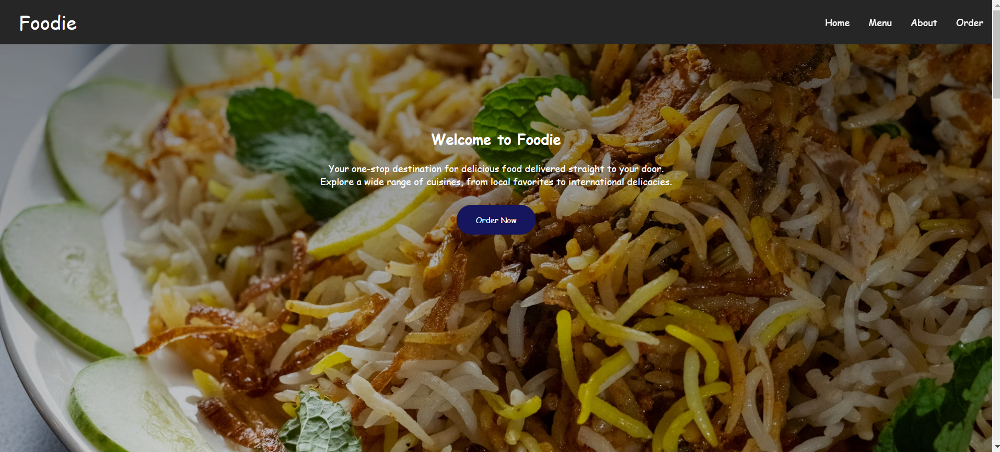
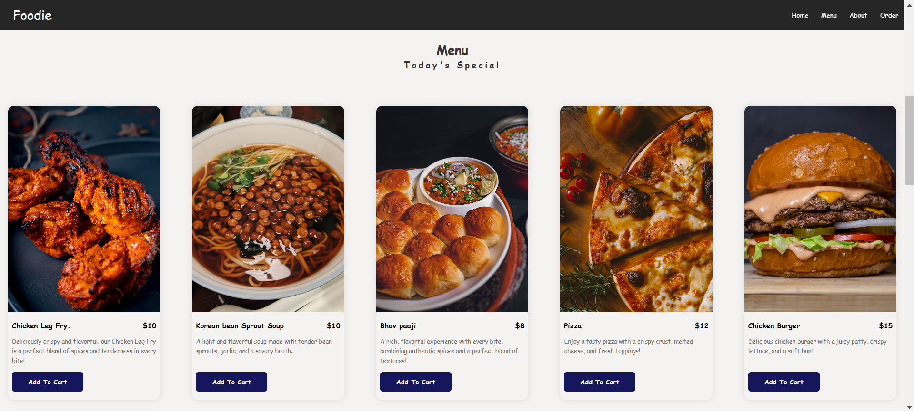
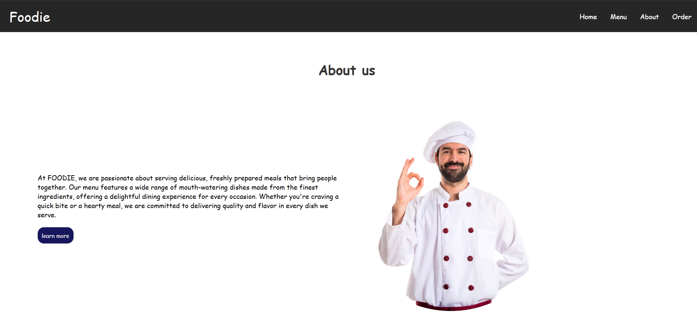
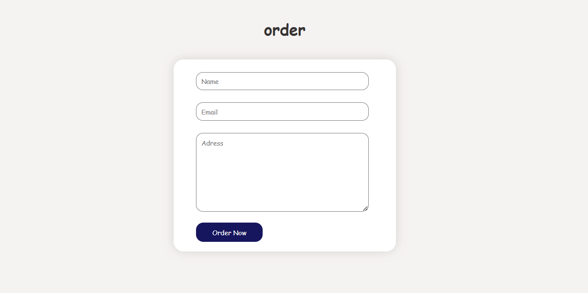

# Foodie - Restaurant Website

Live Link(https://restraurantwebsite.netlify.app/)

**Foodie** is a visually appealing and user-friendly restaurant website designed to provide customers with a seamless experience for exploring the menu, learning about the restaurant, and placing orders online. The website features a modern design and is optimized for both desktop and mobile devices.



## Features
- **Navigation Bar**: Easy-to-use navigation with links to the homepage, menu, about section, and order page.



- **Menu Display**: A visually appealing presentation of food items, each with images, descriptions, prices, and an option to add them to the cart.



- **About Us**: A section that provides information about the restaurant, its values, and what makes it special.



- **Order Form**: A simple form for customers to place their orders by providing their name, email, and delivery address.

- **Mobile Responsive**: The website is designed to be fully responsive and works well on both desktop and mobile devices.

## Technologies Used
- **HTML**: For the structure and content of the website.
- **CSS**: For styling the website and ensuring a responsive design.

## Installation

To set up this project locally on your machine:

1. Clone the repository:
   ```bash
   git clone https://github.com/sugapriya-k/RestrautantClone-Frontend.git
2. Navigate to the project directory:
   ```bash
   cd RestrautantClone-Frontend
3. Open the index.html file in your browser to view the website.

## Future Improvements
- Integrating a backend to fetch dynamic data for the menu and order processing.
- Adding a cart system to allow users to review and modify their order before checkout.
- Enhancing the UI/UX to provide a more engaging experience.
